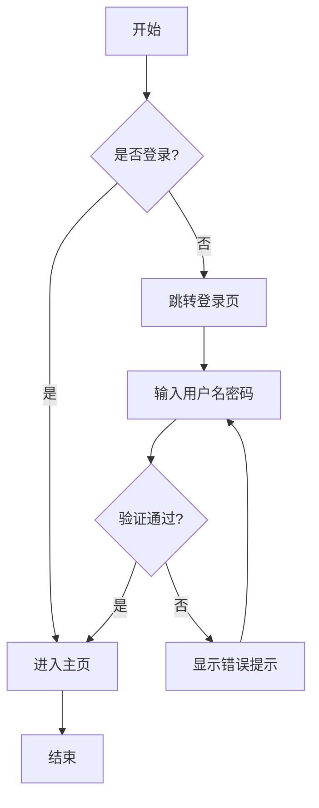
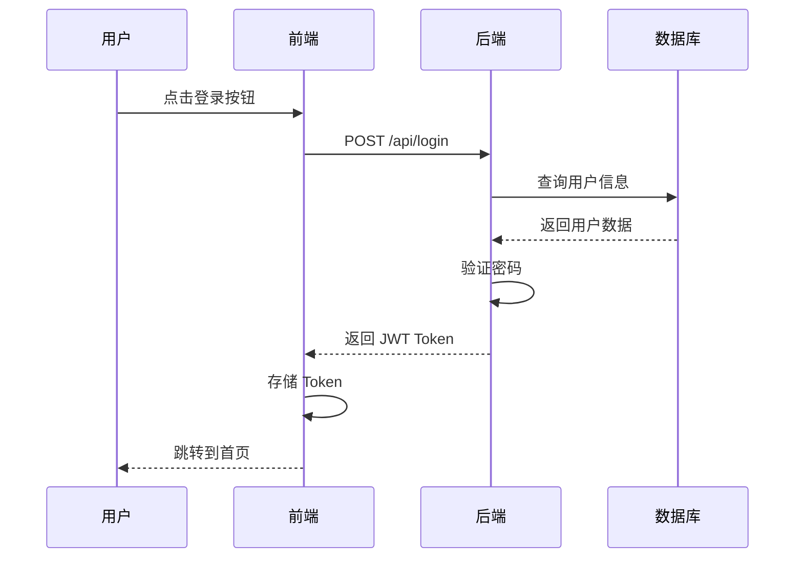
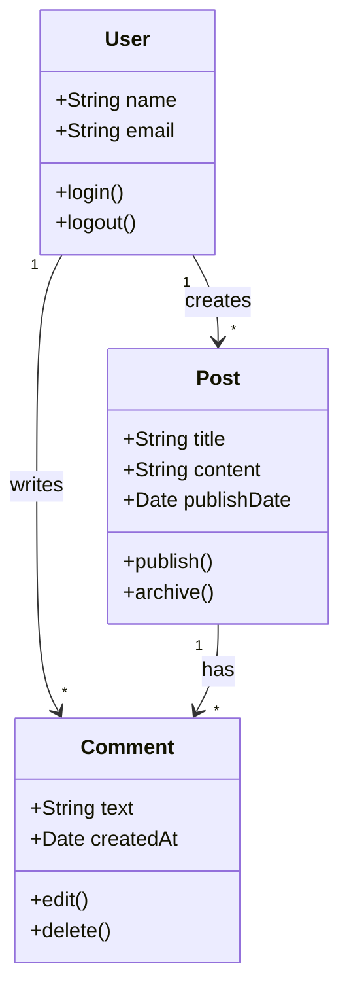
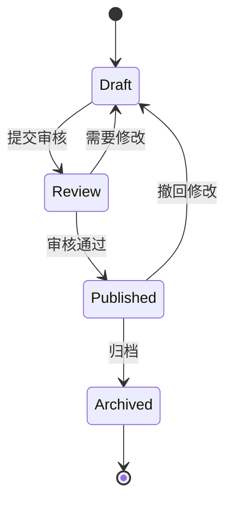
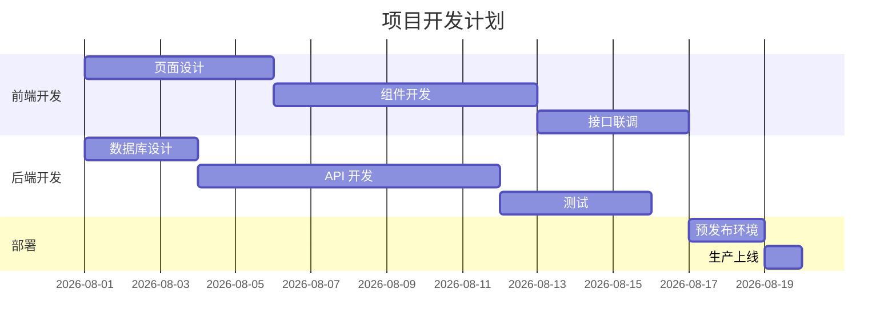
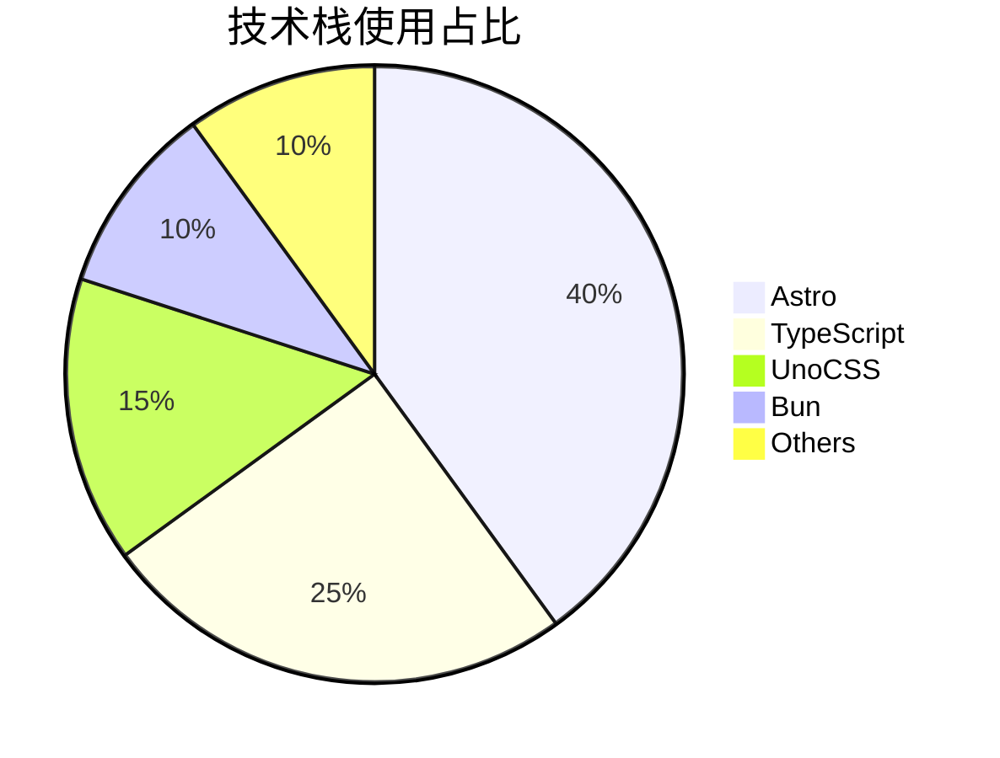

## 一、标题层级测试

# 一级标题 H1

## 二级标题 H2

### 三级标题 H3

#### 四级标题 H4

##### 五级标题 H5

###### 六级标题 H6

## 二、文本格式测试

### 基本文本样式

这是**粗体文字**，这是 _斜体文字_，这是 **_粗斜体文字_**。

这是 ~~删除线文字~~，这是 `行内代码`。

这是 <kbd>Ctrl</kbd> + <kbd>C</kbd> 快捷键。

这是一段包含<sup>上标</sup>和<sub>下标</sub>的文字。化学式：H<sub>2</sub>O，数学：x<sup>2</sup> + y<sup>2</sup> = z<sup>2</sup>。

### 特殊字符与 Emoji

版权符号 &copy; 商标符号 &trade; 注册商标 &reg;

箭头：&larr; &uarr; &rarr; &darr; &harr;

破折号：&mdash; 和 &ndash;

### 高亮与标记

<mark>这段文字被高亮标记</mark>

## 三、列表测试

### 无序列表

- 第一项
- 第二项
  - 嵌套子项 A
  - 嵌套子项 B
    - 更深层嵌套
- 第三项

### 有序列表

1. 第一步：安装依赖
2. 第二步：配置环境
   1. 配置数据库连接
   2. 设置环境变量
3. 第三步：启动服务

### 任务列表

- [x] 已完成：项目初始化
- [x] 已完成：配置文件编写
- [ ] 待完成：单元测试编写
- [ ] 待完成：性能优化
- [ ] 待完成：文档更新

### 混合列表

1. 第一步
   - 子步骤 A
   - 子步骤 B
2. 第二步
   - [x] 已完成子任务
   - [ ] 待完成子任务

## 四、链接测试

### 外部链接

- [GitHub](https://github.com)
- [Astro 官方文档](https://docs.astro.build)
- [MDN Web Docs](https://developer.mozilla.org)

### 内部链接

- [返回首页](/)
- [查看博客列表](/blog)
- [关于页面](/about)

### 自动链接

`<https://www.example.com>`

`<test@example.com>`

### 引用式链接

这是一个[引用式链接][ref1]的示例。

[ref1]: https://www.example.com

## 五、图片展示测试

### 本地图片引用

使用相对路径引用文章目录中的图片：


### 带标题的图片（HTML）

<figure>
  
  <figcaption align="center"><em>图 1：测试图片 — 带标题展示</em></figcaption>
</figure>

### 远程图片引用


### 图片与文字混排

这是一段包含图片的文字。如下所示：


图片可以放在段落之间，形成图文混排的效果。上面这张图片展示了项目的封面图。

## 六、代码块测试

### 基础代码块

```python
def fibonacci(n: int) -> int:
    """计算斐波那契数列的第 n 项"""
    if n <= 1:
        return n
    a, b = 0, 1
    for _ in range(2, n + 1):
        a, b = b, a + b
    return b

# 测试
for i in range(10):
    print(f"F({i}) = {fibonacci(i)}")
```

### 带标题的代码块

```ts title="src/utils/helper.ts"
interface User {
  id: number
  name: string
  email: string
  role: 'admin' | 'user' | 'guest'
}

function greet(user: User): string {
  return `Hello, ${user.name}! You are a ${user.role}.`
}

const admin: User = {
  id: 1,
  name: 'Admin',
  email: 'admin@example.com',
  role: 'admin'
}

console.log(greet(admin))
```

### JavaScript 代码

```js
// 异步数据获取
async function fetchUserData(userId) {
  try {
    const response = await fetch(`/api/users/${userId}`)
    if (!response.ok) {
      throw new Error(`HTTP error! status: ${response.status}`)
    }
    const data = await response.json()
    return data
  } catch (error) {
    console.error('Failed to fetch user data:', error)
    return null
  }
}

// 防抖函数
function debounce(func, delay) {
  let timeoutId
  return function (...args) {
    clearTimeout(timeoutId)
    timeoutId = setTimeout(() => func.apply(this, args), delay)
  }
}
```

### CSS 代码

```css
/* 响应式网格布局 */
.grid-container {
  display: grid;
  grid-template-columns: repeat(auto-fill, minmax(300px, 1fr));
  gap: 1.5rem;
  padding: 2rem;
}

@media (max-width: 768px) {
  .grid-container {
    grid-template-columns: 1fr;
    padding: 1rem;
  }
}

.card {
  border-radius: 12px;
  box-shadow: 0 4px 6px rgba(0, 0, 0, 0.1);
  transition: transform 0.3s ease, box-shadow 0.3s ease;
}

.card:hover {
  transform: translateY(-4px);
  box-shadow: 0 8px 15px rgba(0, 0, 0, 0.15);
}
```

### Shell 命令

```shell title="部署脚本"
# 安装依赖
bun install

# 开发模式
bun dev

# 构建项目
bun run build

# 预览构建产物
bun preview

# 清理构建缓存
bun clean
```

### YAML 配置

```yaml title="docker-compose.yml"
version: '3.8'

services:
  app:
    build: .
    ports:
      - '3000:3000'
    environment:
      - NODE_ENV=production
      - DATABASE_URL=postgresql://user:pass@db:5432/mydb
    depends_on:
      - db
    restart: unless-stopped

  db:
    image: postgres:16-alpine
    volumes:
      - pgdata:/var/lib/postgresql/data
    environment:
      - POSTGRES_USER=user
      - POSTGRES_PASSWORD=pass
      - POSTGRES_DB=mydb

volumes:
  pgdata:
```

### JSON 数据

```json
{
  "project": "Astro Theme Pure",
  "version": "4.1.4",
  "features": {
    "ssr": true,
    "mdx": true,
    "search": true,
    "comments": true
  },
  "dependencies": {
    "astro": "^6.2.1",
    "typescript": "^6.0.3"
  },
  "scripts": {
    "dev": "astro dev",
    "build": "astro build",
    "preview": "astro preview"
  }
}
```

### Diff 代码块

```diff
function calculateTotal(items) {
-  let total = 0
-  for (let i = 0; i < items.length; i++) {
-    total += items[i].price
-  }
+  return items.reduce((sum, item) => {
+    const discount = item.discount ?? 0
+    return sum + item.price * (1 - discount)
+  }, 0)
-  return total
}
```

## 七、表格测试

### 基础表格

| 名称       | 版本   | 描述           | 状态   |
| ---------- | ------ | -------------- | ------ |
| Astro      | 6.2.1  | Web 框架       | 稳定   |
| Bun        | 1.3.13 | JS 运行时      | 活跃   |
| TypeScript | 6.0.3  | 类型系统       | 稳定   |
| UnoCSS     | latest | 原子化 CSS     | 活跃   |

### 对齐方式

| 左对齐     | 居中对齐    |      右对齐 |
| :--------- | :---------: | ----------: |
| 内容 A     |    内容 B   |      内容 C |
| 长文本内容 |  中等文本   |          短 |

### 复杂表格

| 功能             | 支持情况 | 性能评级  | 备注                        |
| ---------------- | :------: | :-------: | --------------------------- |
| SSG（静态生成）  |    ✅    | ⭐⭐⭐⭐⭐ | 默认模式，构建时生成静态 HTML |
| SSR（服务端渲染）|    ✅    |  ⭐⭐⭐⭐  | 需要 adapter 支持           |
| MDX 支持         |    ✅    | ⭐⭐⭐⭐⭐ | 可在 MD 中嵌入组件           |
| 热更新           |    ✅    | ⭐⭐⭐⭐⭐ | 毫秒级 HMR                  |
| 图片优化         |    ✅    |  ⭐⭐⭐⭐  | 基于 sharp，自动压缩转换     |
| 全文搜索         |    ✅    |  ⭐⭐⭐⭐  | Pagefind，构建时生成索引     |

## 八、引用块测试

### 单层引用

> 这是一个简单的引用块。Stay hungry, stay foolish. —— Steve Jobs

### 多层嵌套引用

> 第一层引用
>
> > 第二层嵌套引用
> >
> > > 第三层深度嵌套引用
> >
> > 回到第二层
>
> 回到第一层

### 引用中包含其他元素

> **重要提示**：
>
> - 这是一条重要信息
> - 请注意检查配置
>
> ```js
> console.log('引用块中的代码')
> ```
>
> 引用块中也可以包含 `行内代码` 和 [链接](https://example.com)。

## 九、提示框测试（用引用块模拟）

> **💡 提示 (Tip)**
>
> 这是一个提示信息框。Astro Theme Pure 支持多种 Markdown 语法。

> **⚠️ 警告 (Warning)**
>
> 注意：在生产环境中请确保配置了正确的环境变量。

> **🚫 危险 (Caution)**
>
> 危险操作警告：此操作不可逆，请谨慎执行！

## 十、LaTeX 数学公式测试

### 行内公式

这是行内公式：$E = mc^2$，它表示质能方程。

欧拉恒等式：$e^{i\pi} + 1 = 0$，被称作最美的数学公式。

二次方程求根公式：$x = \frac{-b \pm \sqrt{b^2 - 4ac}}{2a}$

### 块级公式

#### 基础公式

$$
f(x) = \int_{-\infty}^{\infty} \hat{f}(\xi) \, e^{2\pi i \xi x} \, d\xi
$$

#### 矩阵

$$
\begin{bmatrix}
a_{11} & a_{12} & \cdots & a_{1n} \\
a_{21} & a_{22} & \cdots & a_{2n} \\
\vdots & \vdots & \ddots & \vdots \\
a_{m1} & a_{m2} & \cdots & a_{mn}
\end{bmatrix}
\times
\begin{bmatrix}
x_1 \\ x_2 \\ \vdots \\ x_n
\end{bmatrix}
=
\begin{bmatrix}
b_1 \\ b_2 \\ \vdots \\ b_m
\end{bmatrix}
$$

#### 分段函数

$$
f(x) =
\begin{cases}
x^2 & \text{if } x \geq 0 \\
-x^2 & \text{if } x < 0
\end{cases}
$$

#### 求和与极限

$$
\sum_{n=1}^{\infty} \frac{1}{n^2} = \frac{\pi^2}{6}
$$

$$
\lim_{x \to 0} \frac{\sin x}{x} = 1
$$

#### 多行公式对齐

$$
\begin{aligned}
\nabla \cdot \mathbf{E} &= \frac{\rho}{\varepsilon_0} \\
\nabla \cdot \mathbf{B} &= 0 \\
\nabla \times \mathbf{E} &= -\frac{\partial \mathbf{B}}{\partial t} \\
\nabla \times \mathbf{B} &= \mu_0 \mathbf{J} + \mu_0\varepsilon_0\frac{\partial \mathbf{E}}{\partial t}
\end{aligned}
$$

#### 概率与统计

$$
P(A|B) = \frac{P(B|A) \cdot P(A)}{P(B)}
$$

$$
\mathcal{N}(x \mid \mu, \sigma^2) = \frac{1}{\sqrt{2\pi\sigma^2}} \exp\left(-\frac{(x-\mu)^2}{2\sigma^2}\right)
$$

## 十一、Mermaid 图表测试

> **注意**：Mermaid 代码块需要安装对应的渲染插件才能在前端正确显示。以下代码块展示了 Mermaid 语法，在支持 Mermaid 的环境中可以直接渲染为图表。

### 流程图 (Flowchart)



### 时序图 (Sequence Diagram)



### 类图 (Class Diagram)



### 状态图 (State Diagram)



### 甘特图 (Gantt Chart)



### 饼图 (Pie Chart)



## 十二、HTML 元素测试

### 折叠面板

<details>
  <summary>点击展开查看更多内容</summary>

这里是折叠面板中的隐藏内容。

可以包含各种 Markdown 元素：

- 列表项
- **粗体文字**

```js
console.log('折叠面板中的代码')
```

</details>

### 自定义样式

<div align="center" style="padding: 20px; border: 2px dashed #4A90D9; border-radius: 12px; margin: 20px 0;">

**这是一个自定义样式的 DIV 容器**

可以用于创建特殊的提示框或信息展示区域

</div>

## 十三、脚注测试

这是一个带有脚注的句子[^first]。

这是另一个脚注引用[^second]，用于测试多个脚注。

还有一个长脚注[^longnote]。

[^first]: 这是第一个脚注的详细内容。脚注通常出现在页面底部。

[^second]: 第二个脚注，可以包含**粗体**、`代码` 等格式。

[^longnote]: 这是一个较长的脚注示例。脚注可以包含多行文字，甚至可以包含列表：
    - 列表项一
    - 列表项二
    脚注在文章末尾自动渲染。

## 十四、分隔线测试

上面是一段文字。

---

使用三个短横线分隔。

* * *

使用星号分隔。

---

下面也是一段文字。

## 十五、步骤列表测试

**第一步：创建项目**

使用命令行创建新的 Astro 项目。

**第二步：安装依赖**

```shell
bun install
```

**第三步：启动开发服务器**

```shell
bun dev
```

**第四步：打开浏览器预览**

访问 `http://localhost:4321` 查看效果。

## 十六、多语言代码对比

### TypeScript 实现

```ts
interface Config {
  site: string
  title: string
  description: string
}

const config: Config = {
  site: 'https://example.com',
  title: 'My Blog',
  description: 'A personal blog'
}
```

### Python 实现

```python
from dataclasses import dataclass

@dataclass
class Config:
    site: str
    title: str
    description: str

config = Config(
    site="https://example.com",
    title="My Blog",
    description="A personal blog"
)
```

### Rust 实现

```rust
struct Config {
    site: String,
    title: String,
    description: String,
}

let config = Config {
    site: String::from("https://example.com"),
    title: String::from("My Blog"),
    description: String::from("A personal blog"),
};
```

## 十七、折叠内容测试

<details>
  <summary>展开查看更多技术细节</summary>

这是一段折叠内容，点击标题可以展开或收起。

- 技术细节 A
- 技术细节 B
- 技术细节 C

```js
const details = {
  framework: 'Astro',
  language: 'TypeScript',
  styling: 'UnoCSS'
}
```

</details>

## 十八、时间线测试

- **2024-01** — 项目立项与需求分析
- **2024-03** — 完成原型设计和架构评审
- **2024-06** — 发布 v1.0 正式版本
- **2024-09** — 发布 v2.0，支持 MDX 和搜索
- **2025-01** — 发布 v3.0，重构主题架构
- **2025-07** — 发布 v4.0，全面升级 Astro 6

## 十九、综合测试场景

### 技术文档示例

> **摘要**：本文档介绍了如何使用 Astro Theme Pure 构建博客系统。涵盖了项目初始化、配置管理和内容编写的最佳实践。

#### 1. 项目结构

```
my-blog/
├── src/
│   ├── content/
│   │   └── blog/
│   ├── pages/
│   └── site.config.ts
├── public/
├── astro.config.ts
└── package.json
```

#### 2. 配置示例

| 配置项         | 类型     | 必填 | 说明             |
| -------------- | -------- | :--: | ---------------- |
| `title`        | `string` |  是  | 网站标题         |
| `author`       | `string` |  是  | 作者名称         |
| `description`  | `string` |  是  | 网站描述         |
| `blogPageSize` | `number` |  否  | 每页文章数量     |

#### 3. 代码示例

```ts title="src/site.config.ts"
export const theme: ThemeUserConfig = {
  title: 'My Blog',
  author: 'Author Name',
  description: 'A personal blog',
  locale: {
    lang: 'zh-CN',
    attrs: 'zh_CN',
    dateLocale: 'zh-CN',
    dateOptions: {
      day: 'numeric',
      month: 'long',
      year: 'numeric'
    }
  }
}
```

### 数学证明示例

> **定理**：对于任意正整数 $n$，有 $\sum_{k=1}^{n} k = \frac{n(n+1)}{2}$

**证明**：

设 $S = 1 + 2 + 3 + \cdots + n$，

则 $2S = (1 + n) + (2 + (n-1)) + \cdots + (n + 1) = n(n+1)$，

因此 $S = \frac{n(n+1)}{2}$。$\square$

---

**总结**：本文涵盖了 Markdown 的绝大多数语法特性，包括文本格式、列表、代码块（带标题、行号、diff 高亮）、表格、引用、LaTeX 数学公式、Mermaid 图表、HTML 元素、脚注、分隔线等。可以作为日常写作的语法参考手册。
